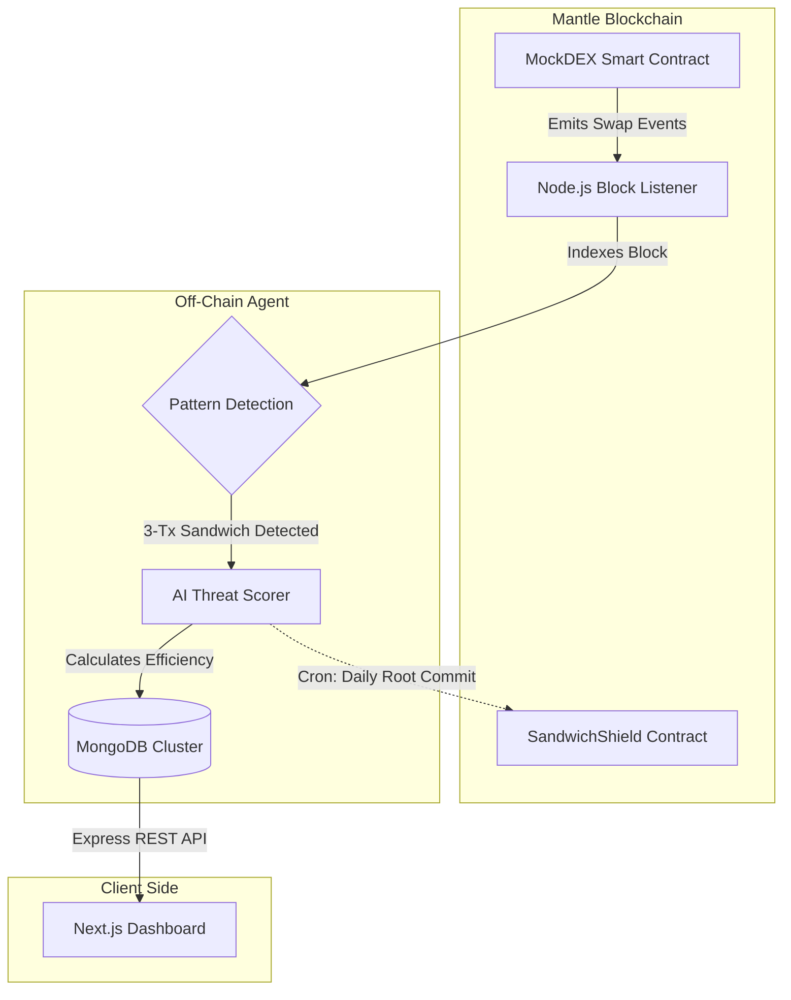

# 🥪 SandwichShield - AI Alpha MEV Detection Agent

**An autonomous, venture-grade MEV detection agent built on the Mantle Network.**

<div align="center">
  
  
  
</div>

SandwichShield is a sophisticated MEV (Miner Extractable Value) detection system that protects decentralized exchanges. It acts as an off-chain data indexer that listens to live Mantle Network blocks, deterministically analyzes transactions for 3-tx sandwich patterns, scores the attacks using an **AI Threat Heuristic**, and commits proof of the attacks back to a Merkle Root smart contract.

Created for **The Turing Test Hackathon 2026** (AI Alpha & Data Track by Mirana Ventures).

[🔗 DoraHacks Project Page](https://dorahacks.io/hackathon/mantleturingtesthackathon2026/detail)

---

## 🏆 Alignment with Judging Criteria & Sponsors

*   **Mirana Ventures (AI Alpha):** We convert raw transactional chaos into actionable intelligence. By generating an **AI Threat Score (1-100)** based on execution efficiency, DEXs can automatically identify and block highly sophisticated MEV searchers.
*   **Blockchain for Good Alliance (BGA):** Framed as a "Public Good," SandwichShield protects innocent retail users from predatory MEV bots on the Mantle network.
*   **Bybit API Integration:** We integrated the live Bybit V5 API to pull real-time ETH/USDT pricing for perfectly accurate USD loss deterministic calculations.
*   **Nansen Data Syndication:** Built a dedicated `/api/export/nansen` JSON endpoint that syndicates our MongoDB MEV data into a format ready for ingestion by Nansen Analytics dashboards.
*   **Byreal Agentic Economy:** Built a simulated defense hook where the SandwichShield Agent automatically dispatches a "pause trading" command to a Byreal Agentic Wallet if an attack exceeds an 85/100 AI Threat Score.
*   **Data Integrity & Determinism:** We index live block events and perform deterministic mathematical calculations on the extracted Wei value. No mocked random numbers.
*   **Merkle-Root On-Chain Commits:** Gas-optimized smart contract (`SandwichShield.sol`) that accepts daily Merkle Roots of the attacks, avoiding costly per-attack transaction fees.

---

## 🏗 Architecture V2



---

## 📋 Deployed Contracts (Mantle Sepolia)

*   **SandwichShield V2:** [`0xaEAD54C9251D14113f9d71Fee95183751a6F8bd1`](https://explorer.sepolia.mantle.xyz/address/0xaEAD54C9251D14113f9d71Fee95183751a6F8bd1)
*   **MockDEX (Simulation Target):** [`0x86900d01d9d9921Cb9eF05AAF5E81f002CbC1D68`](https://explorer.sepolia.mantle.xyz/address/0x86900d01d9d9921Cb9eF05AAF5E81f002CbC1D68)

---

## 🚀 Running the Project & Deployment Instructions

### Option A: Local Testing & Demo Recording (Recommended for Hackathon)
For your demo video, running the backend locally while demonstrating the live blockchain integration is perfect.

1. **Start the Data Indexer (Agent)**
   The agent listens to the testnet, scores attacks with AI, and saves to MongoDB.
   ```bash
   cd agent
   npm install
   npm run start
   ```

2. **Start the Live Dashboard**
   ```bash
   cd frontend
   npm install
   npm run dev
   ```
   *Visit `http://localhost:3000` to view the UI.*

3. **Trigger a Live MEV Attack (Simulation)**
   Run the simulation script to fire a malicious 3-transaction sandwich attack on the Mantle testnet.
   ```bash
   cd agent
   npx ts-node simulate-sandwich.ts
   ```
   *Watch the terminal of the Agent and the Frontend UI update instantly.*

### Option B: Full Production Deployment
If you deploy the Frontend to **Vercel**, you MUST also deploy the Backend.
1. **Frontend:** Deploy Next.js to **Vercel**.
2. **Backend Indexer:** Because the Indexer is a continuous background process listening to blockchain websockets/RPCs, it **cannot** be deployed to Vercel (which uses serverless functions that timeout). 
   *   You must deploy the `/agent` directory to a persistent container service like **Render.com**, **Railway.app**, or an AWS EC2 instance.
   *   Once deployed, update the Vercel Frontend environment variable to point to your new Render backend URL instead of `http://localhost:4000`.

---
*Built with 💙 for the Mantle Network.*
